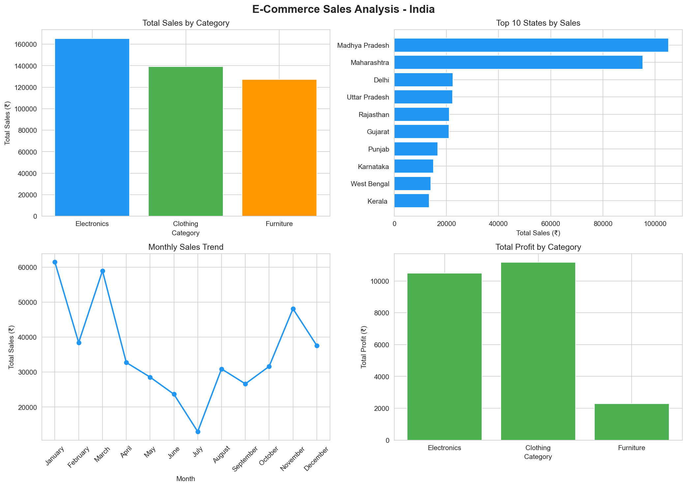
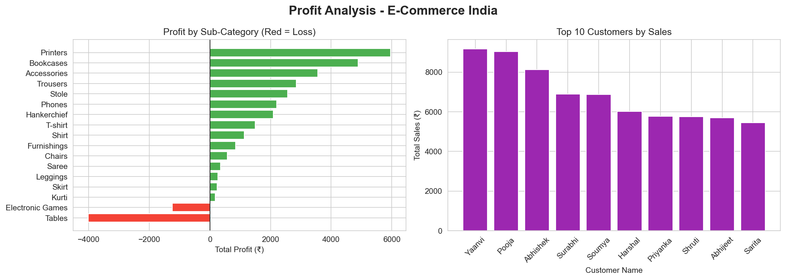

 🛒 India E-Commerce Sales Analysis

 📌 Project Overview
Exploratory data analysis on an Indian e-commerce dataset containing 
1,500+ order records across multiple states, categories, and customers.
The goal was to identify sales trends, profitable categories, and 
loss-making products to provide actionable business recommendations.

 🛠️ Tools & Technologies
- Python 3
- Pandas (data cleaning & analysis)
- Matplotlib & Seaborn (visualizations)
- Jupyter Notebook

 📊 Key Findings
1. **Electronics** leads in total sales (₹1,65,267) but **Clothing** is more profitable (₹11,163 vs ₹10,494)
2. **Madhya Pradesh & Maharashtra** account for ~46% of total revenue
3. **January & March** are peak months — July sees a 79% sales drop
4. **Tables** are the biggest loss-maker (-₹4,011) — pricing review needed
5. **Printers** are the most profitable sub-category

 📈 Visualizations
 Sales & Profit Analysis

 Profit by Sub-Category & Top Customers

 💡 Business Recommendations
- Focus marketing budget on Madhya Pradesh & Maharashtra
- Run promotional campaigns in July to counter seasonal slump
- Review Tables product pricing — currently loss-making
- Expand Clothing category — highest profit margins

 📂 Dataset
Source: [E-Commerce Data - Kaggle](https://www.kaggle.com/datasets/benroshan/ecommerce-data)
